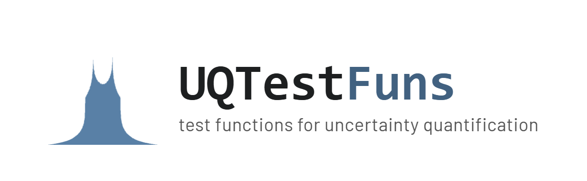
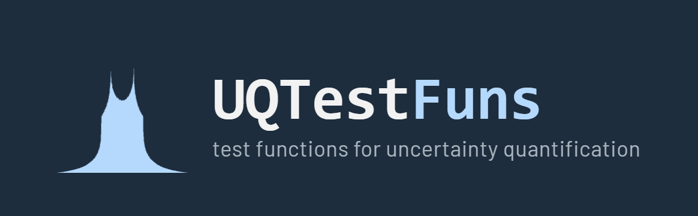

```{raw} html
<script>
document.addEventListener('DOMContentLoaded', function() {
    if (window.innerWidth < 992) return;
    var btn = document.querySelector('.sidebar-toggle.primary-toggle, [data-bs-target="#bd-docs-nav"]');
    if (btn && btn.getAttribute('aria-expanded') !== 'false') btn.click();Wia
});
</script>
```

<div style="visibility: hidden; margin: -2.5em;">

# UQTestFuns documentation

</div>

<div align="center">
  
  
</div>

<br>

UQTestFuns is an open-source Python library of test functions for the
applied uncertainty quantification (UQ) community: one consistent
interface, minimal dependencies (NumPy, SciPy, PyYAML, and tabulate), and each function's
probabilistic input specification bundled in, so you don't have to
reimplement it yourself.


::::{grid}
:gutter: 2

:::{grid-item-card} Getting Started
:text-align: center
New to UQTestFuns? Start with the tutorials.
For background on what these test functions are
and why they exist, see the introduction.
+++
```{button-ref} getting-started:tutorials
:ref-type: myst
:color: primary
:outline:
To the UQTestFuns Tutorials
```
```{button-ref} getting-started:about-uq-test-functions
:ref-type: myst
:color: primary
:outline:
To the Introduction
```
:::

:::{grid-item-card} User Guide
:text-align: center

Browse the full list of available test functions,
grouped by their typical use in UQ analyses.
For defining a probabilistic input model,
see the dedicated reference section.
+++
```{button-ref} test-functions:available
:ref-type: myst
:color: primary
:outline:
To the List of Available Functions
```
```{button-ref} prob-input:overview
:ref-type: myst
:color: primary
:outline:
To the Probabilistic Input Modeling
```
:::

::::


::::{grid}
:gutter: 2

:::{grid-item-card} API Reference
:text-align: center
The API reference guide has the full detail on high-level entities
(functions, classes, methods, and properties) in UQTestFuns.
+++
```{button-ref} api-reference:overview
:ref-type: myst
:color: primary
:outline:
To the API Reference
```

:::

:::{grid-item-card} Contributor's Guide
:text-align: center
If you're interested in extending UQTestFuns, be it adding new test functions,
new distributions, or new reference results,
see the Contributor's Guide.
+++
```{button-ref} development:overview
:ref-type: myst
:color: primary
:outline:
To the Contributor's Guide
```
:::

::::

